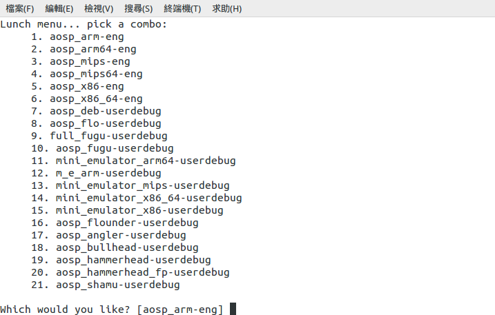
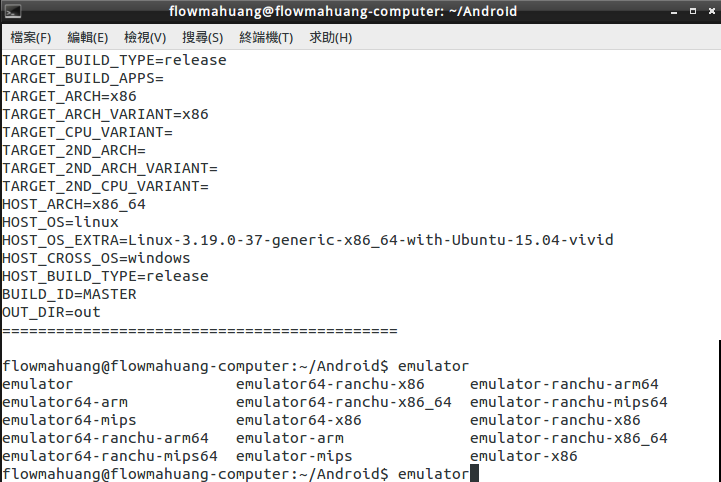
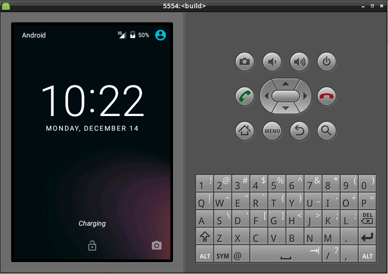

#Build AOSP

## Development Environment
- Ubuntu 15.04
- openJDK 1.7(oracle的jdk1.7與以上版本似乎不支援)

```
    sudo apt-get install openjdk-7-jdk
```

## Built Environment

- 硬碟需預留約3GB存放Android之source code

- 如果你的電腦有多個版本的JDK可使用以下指令切換

```
sudo update-alternatives --config java
sudo update-alternatives --config javac
```

- 根據Google所釋出之資料，使用系統Ubuntu 14.04編譯時需要安裝以下套件

```
sudo apt-get install git-core gnupg flex bison gperf build-essential \
zip curl zlib1g-dev gcc-multilib g++-multilib libc6-dev-i386 \
lib32ncurses5-dev x11proto-core-dev libx11-dev lib32z-dev ccache \
libgl1-mesa-dev libxml2-utils xsltproc unzip
```

詳細請參考<https://source.android.com/source/initializing.html>

- 下載Source code需使用Git及Repo，透過curl下載repo並修改檔案屬性為可執行

```
curl https://storage.googleapis.com/git-repo-downloads/repo > ~/bin/repo
chmod a+x ~/bin/repo
```

- 下載編譯時需要的ninja套件

```
sudo apt-get install ninja
```

## Start to build

<font size=4>1.設定Repo下載資料夾：</font>

這裡設定為~/家目錄/AOSP，在家目錄下新增資料夾AOSP，進入並使用終端機開啟後將Repo初始化。

```
cd
mkdir AOSP
cd AOSP
repo init -u https://android.googlesource.com/platform/manifest
```

如果要下載其他版本之原始碼也可以指定分支，使用-b參數指定某分支，如下為Nexus 6P之Android6.0.1原始碼，不指定即為預設分支master。

```
repo init -u https://android.googlesource.com/platform/manifest -b android-6.0.1_r3
```

<font size=4>2.使用repo sync指令開始同步：</font>

使用-j參數使用多個執行續同時下載，例如下列：

```
repo sync -j4
```

即是使用4個Thread同時進行。

如果下載中斷，再次執行指令即可
```
repo sync
```

<font size=4>3.編譯Android原始碼：</font>

在Android目錄下開啟終端機執行：

```
source bulid/envsetup.sh
lunch
make -j4
```
執行編譯前必須先執行envsetup.sh指令稿，這個指令稿會建立Android的編譯環境。

lunch指令為指定目前編譯的產品，預設使用aosp-arm編譯即可，如果想要用使用Intel HAXM技術加速x86模擬可以參考下面第五節。

第一次編譯的時間相當長，而影響編譯速度的最大因素是CPU與記憶體，在電腦狀況許可下使用更多執行序編譯可有效降低編譯時間。

<font size=4>4.使用模擬器開啟：</font>

設置環境變量：

```
export PATH=$PATH:~/Android/out/host/linux-x86/bin
export ANDROID_PRODUCT_OUT=~/Android/out/target/product/generic
```

執行模擬器，後方無參數即為預設值。

```
emulator
```

就可以啟動模擬器執行剛剛編譯完的Android。

如果下次開啟終端機無法執行emulator並已經設定好環境變量：

```
source bulid/envsetup.sh
lunch
```

即可執行emulator。

<font size=4>**可選**5.使用Intel HAXM技術加速執行模擬器</font>

使用俱備虛擬化技術的Intel CPU即可使用此技術大幅加速模擬器運行。

檢查CPU是否支援虛擬化指令如下

```
egrep –c ‘(vmx|svm)’ /proc/cpuinfo
```

安裝前請先確認電腦有安裝Android SDK。

(1)安裝KVM

檢查電腦是否支援KVM：

```
kvm-ok
```

若 KVM 已安裝，會看見以下訊息：

```
INFO: /dev/kvm exists
KVM acceleration can be used"
```

若未安裝則會出現訊息，請至bios開啟Intel VT:

```
"INFO: KVM is disabled by your BIOS
HINT: Enter your BIOS setup and enable Virtualization Technology (VT),
and then hard poweroff/poweron your system
KVM acceleration can NOT be used"
```

安裝kvm及其他需要套件:

```
sudo apt-get install qemu-kvm libvirt-bin ubuntu-vm-builder bridge-utils
```

接下來請將您的使用者加入至 KVM 群組及 libvirtd 群組，更改your_user_name為你的使用者名稱：

```
sudo adduser your_user_name kvm
sudo adduser your_user_name libvirtd
```

完成後請重新登入使設定生效，如欲測試是否安裝成功：

```
sudo virsh -c qemu:///system list
```

(2)編譯X86版本之Android

HAXM技術支援核心為X86之Android，我們需要編譯一個X86版本的Android：

```
lunch
```



在執行lunch時可以選擇編譯的版本，這個時候我們可以選擇選項5「aosp-x86-eng」，這樣make的時候就是編譯x86的版本，對其他選項有興趣也可以自行試試。

接著執行make即可。

(3)使用X86模擬器開啟

當執行emulator後面不指定參數時會執行預設值開啟arm模擬器，但我們可以在後方加上參數，輸入emulator後按tab查看。



這個時候可以視電腦是32或是64位元執行emulator64-x86或是emulator-x86，都是x86的模擬器。


<font size=4>執行結果</font>


